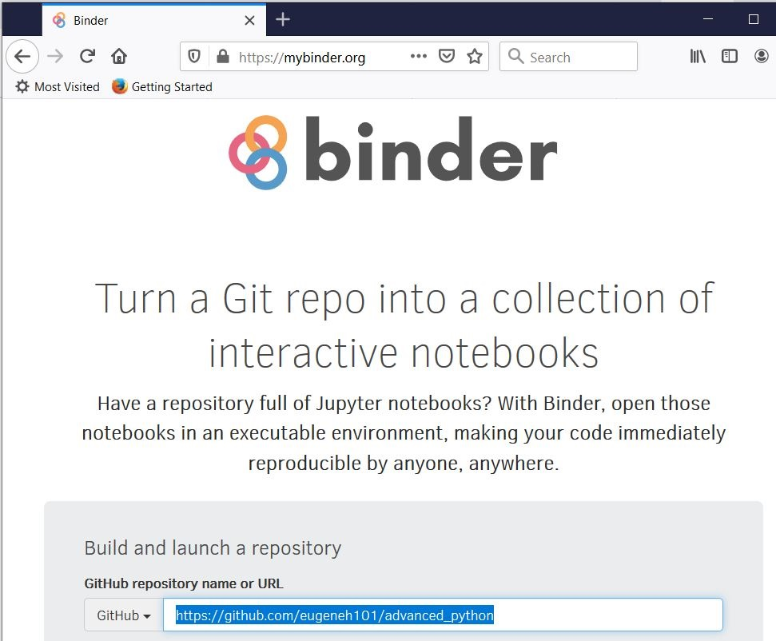

# So you want to be a ~~millionaire~~ awesome Python programmer? 

* You want to code like the pros.
* You want to write elegant, clean code that your colleagues consider "best practice" (AKA "idiomatic" Python).
* You want to write high-quality code, so that you and your colleagues can maintain it in the future ... so you can go home earlier AND PARTY IT UP.
* You  want to be the coolest programmer on your team, get promoted to Senior Principal Python Genius, and make the BIG $$$!
* You want to learn how the descriptor protocol implements magic method calls, which you can hijack by inserting malicious code into super classes such that method calls up the C3 linearization graph destroy your competitor's code! 

Well, if you are reading this notebook for the right reasons, you'll be a __certified Python Pro!__ If not..., even better: you'll be a __millionaire  watching your competitor crying in ruins!__
<p align="center"></p>

# Why Python?
Python takes a Multi-paradigm approach:
* Pragmatic problem solving: Lua, PHP, Perl
* Procedural programming: C, Rust, Cython
* Object-oriented programming: Java, C#, Eiffel
* Functional programming: Haskell, Scala, Clojure, F#
* High performance with parallel/array-oriented processing: MATLAB/Octave, Julia, R, Rust, Go
* Asynchronous/Event-driven programming: JavaScript, Go, Erlang, Elixir


Other testimonials:
"It is the most frequently taught first language at universities nowadays, it is number one in the statistical domain, number one in AI programming, number one in scripting and number one in writing system tests. Besides this, Python is also leading in web programming and scientific computing (just to name some other domains). In summary, Python is everywhere." <br>  

"There are several reasons for Python's rapid rise, bloom, and dominance in multiple domains, including web development, scientific computing, testing, data science, machine learning, and more. The reasons include its readable and maintainable code; extensive support for third-party integrations and libraries; modular, dynamic, and portable structure; flexible programming; learning ease and support; user-friendly data structures; productivity and speed; and, most important, community support. The diverse application of Python is a result of its combined features, which give it an edge over other languages." <br>  

"Very few languages can match Python's ability to conform to a developer's coding style rather than forcing him or her to code in a particular way. Python lets more advanced developers use the style they feel is best suited to solve a particular problem." <br>  

TLDR: high level qualities of Python:  
* Ease of learning  
* Economy of expression  
* Readability and beauty  
* Batteries included  
* Rapid development cycle  
* Interactive prompt  
* One way to do it  


Guido van Rossum (retired Benevolent Dictator for Life [BFDL]) emphasizes readability over speed. Here's some other fundamental core tenets of Python.  
```python
import this
# The Zen of Python, by Tim Peters

# Beautiful is better than ugly.
# Explicit is better than implicit.
# Simple is better than complex.
# Complex is better than complicated.
# Flat is better than nested.
# Sparse is better than dense.
# Readability counts.
# Special cases aren't special enough to break the rules.
# Although practicality beats purity.
# Errors should never pass silently.
# Unless explicitly silenced.
# In the face of ambiguity, refuse the temptation to guess.
# There should be one-- and preferably only one --obvious way to do it.
# Although that way may not be obvious at first unless you're Dutch.
# Now is better than never.
# Although never is often better than *right* now.
# If the implementation is hard to explain, it's a bad idea.
# If the implementation is easy to explain, it may be a good idea.
# Namespaces are one honking great idea -- let's do more of those!


# Another Easter egg
from __future__ import braces
# SyntaxError: not a chance
```


# Don't Just Listen, Show Me the Code
Go to https://mybinder.org and copy+paste this repo url (https://github.com/eugeneh101/advanced_python) into "GitHub repository name or URL". Or you can simply click on this link (https://mybinder.org/v2/gh/eugeneh101/advanced_python/master) or this neat button ([](https://mybinder.org/v2/gh/eugeneh101/advanced_python/master?urlpath=lab)). mybinder.org allows you to run Jupyter Notebooks for any repo for free!  
<p align="center"></p>


# Spoilers
Here's a sneek peek of topics covered in each notebook. If you see a topic that you want to especially learn, just jump to that notebook!  
<br>
<b>1_Pragmatic_Python.ipynb</b>: Quickstart Guide to Writing Idiomatic Python
* Warmups
    * `enumerate/zip`
    * Versatility of `dict`s
    * Ternary operators
    * List comprehension
        * Nested comprehension and double list comprehension
        * Dict, set, and tuple comprehension
    * `try/except`
* Practical Object-Oriented Programming
* Practical Functional Programming
    * Lambda functions
    * `map/filter/reduce`
* Generators/lazy iterators
    * Generator expressions
    * Generator functions
    * Infinite generators
* `*args/**kwargs`
* Decorators
* Helpful libraries
* Pythonic syntax
    * String interpolation
    * Context manager
    * Implicit line concatenation and implicit string concatenation
    * Trailing comma
    * PEP8: Python's style guide

<b>2_Procedural_Python.ipynb</b>: Mastering Control Flow
* Difference between expression and statement  
* `pass/break/continue`
* `if/elif/else` construct
* `for/else` construct
* `while/else` construct
* `try/except/else/finally` construct
    * Context manager with `try/finally`
* case/switch statement in Python

<b>3_Object_Oriented_Python.ipynb</b>: Deep Dive into Object-Oriented Programming
* Class/object/method/attribute
* Methods types
    * Instance method
    * Class method
    * Static method
* Attribute types
    * Instance attribute
    * Class attribute
* Similarities between a module and a class
* Classic classes vs new-style classes
* `@property`: accessor (getter) and mutator (setter)
* Fluent interface
* Python's data model: magic/dunder methods
    * Objects are really dictionaries underneath
    * Method overriding
    * Operator overloading
    * Making an instance callable
    * Context manager with `__enter__/__exit__`
* Inheritance
    * `super()` for extending a parent class's method
    * Advanced inheritance topics
    * Advanced OOP tricks

<b>4_Functional_Python.ipynb</b>: Deep Dive into Functional Programming
* `map/filter/reduce` + `starmap`
* Functional programming + method chaining
* Immutability (and copying)
* Pure functions
* High-order functions
* Decorator deep dive
    * Closure
    * `*args/**kwargs`
    * `@wraps`
    * Decorator on top of decorator
    * Decorator with arguments
* Functions are first class
* Caching
* Currying
* Partial functions
* Function Composition

<b>5_High_Performance_Python.ipynb</b>: Writing Performant Python at Scale
* Big O notation: runtime and space complexity
* Vectorization/SIMD parallelization
* Multithreading (concurrency)
* Multiprocessing (parallelism)
* Event-driven/asynchronous programming
    * Coroutines
* MapReduce/Spark/Dask

<b>6_Pedantic_Python_Tricks.ipynb</b>: Extra Tricks of the Trade
* Name binding
    * Reference counting
    * Tuple unpacking
    * Multiple assignment
    * Tuple unpacking + multiple assignment
    * Accidentally overwriting a built-in
* Multiple comparison
* Short ciruiting with `and` + `or`
* Variable scoping/namespace: LEGB rule
    * One value for a given variable name in a given namespace
* (Re)assignment with `global` and `nonlocal`
* `exec` and `eval`
* Don't use mutable default arguments
* Don't fear importing a module multiple times
* Extra fun details
    * Specification vs implementation
    * Interpreted vs compiled
    * Dynamically typed vs statically typed
    * Strongly typed vs weakly typed
    * Pass by object
* Not (really) one way to do it
* New features: looking into the future